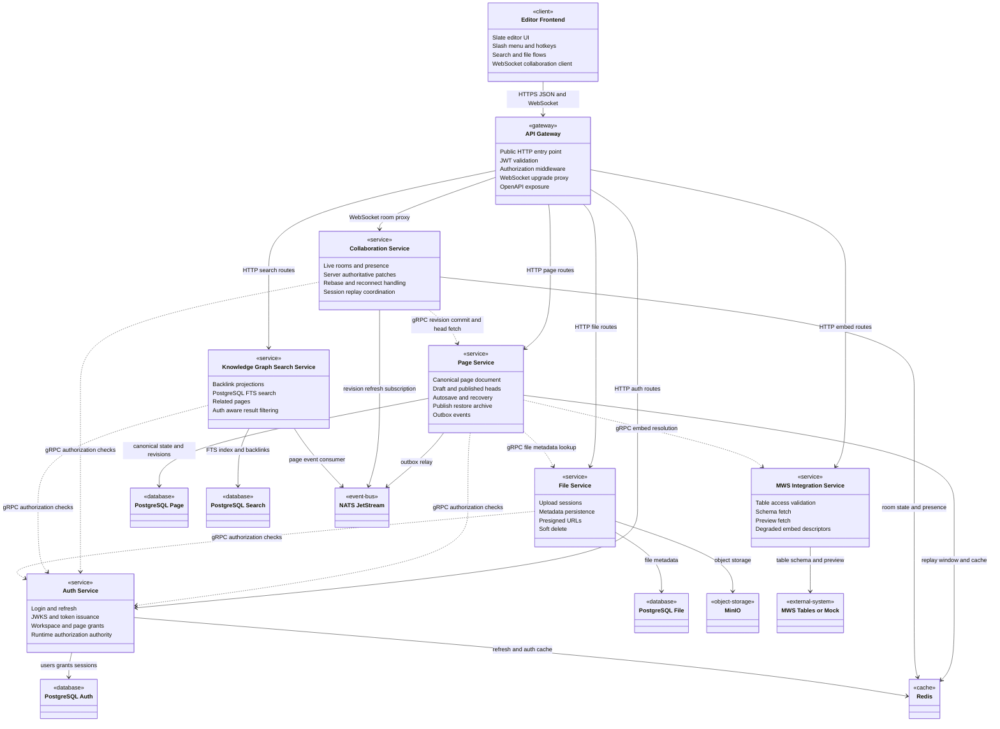
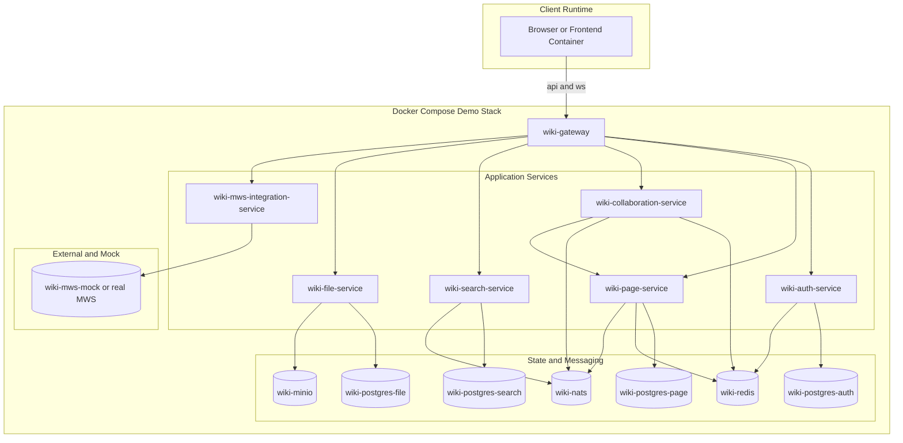
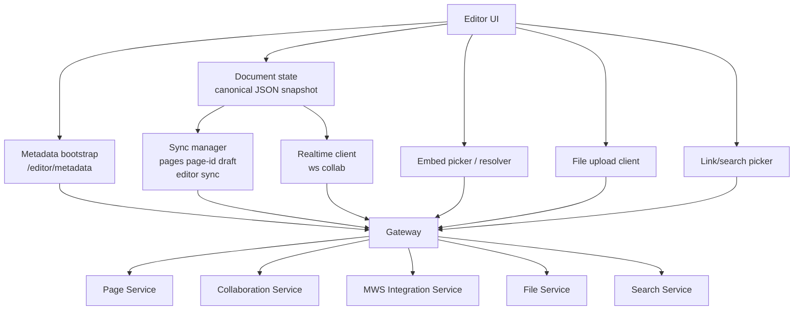

# MTC Wiki Editor Backend

Backend monorepo для wiki editor platform из `specs/001-wiki-editor-backend`.

Основной README в репозитории теперь русский.

Репозиторий содержит рабочий demo stack:

- API Gateway
- Auth Service
- Page Service
- Collaboration Service
- Knowledge Graph / Search Service
- MWS Integration Service
- File Service
- PostgreSQL базы по bounded context
- Redis
- NATS JetStream
- MinIO
- MWS mock

Основной и рекомендуемый способ запуска: Docker Compose.

## Быстрые ссылки

| Раздел | Что внутри |
|---|---|
| [Что уже реализовано](#что-уже-реализовано) | Краткий список готовых возможностей |
| [Архитектура](#архитектура) | Сервисная схема и зоны ответственности |
| [Компоненты редактора и интеграции](#компоненты-редактора-и-интеграции) | Как frontend editor подключается к backend |
| [Матрица фич](#матрица-фич-из-wikilive-template) | Что реализовано, что частично, чего нет |
| [Быстрый запуск](#быстрый-запуск) | Как поднять стек |
| [Demo Walkthrough](#demo-walkthrough) | Последовательность показа на демо |
| [Troubleshooting](#troubleshooting) | Что делать, если стек не стартует |

## Что уже реализовано

- создание страницы, draft save, publish, restore, archive
- live MWS table embeds с degraded fallback
- realtime collaboration по WebSocket с server-authoritative patch flow
- backlinks и PostgreSQL-backed search
- file upload, finalize, lookup и soft delete
- RBAC через Auth Service runtime path
- editor metadata, slash-menu catalog, hotkeys и sync resume
- end-to-end Compose smoke validation

## Статус проекта

| Область | Статус |
|---|---|
| Docker Compose demo runtime | Готов |
| Compose smoke test | Проходит end-to-end |
| Core page lifecycle | Реализован |
| Realtime collaboration | Реализован |
| Search, backlinks, files, RBAC | Реализованы |
| Editor metadata и sync resume | Реализованы |

## Архитектура

### UML Component Diagram



### Deployment Diagram



### Legend

- `HTTPS JSON and WebSocket` — публичный frontend protocol через gateway
- `gRPC` — внутренние synchronous service-to-service checks и lookup calls
- `NATS JetStream` — outbox relay, projections, revision refresh
- `Redis` — session state, presence, replay window, auth/session cache
- `PostgreSQL` — постоянное состояние bounded context
- `MinIO` — object storage для файлов и вложений

### Ответственность сервисов

- `API Gateway`: единая публичная точка входа, JWT/auth middleware, OpenAPI, WebSocket upgrade proxy.
- `Auth Service`: login, refresh, JWKS, workspace/page grants, runtime authorization authority.
- `Page Service`: canonical document snapshot, draft/published heads, autosave, restore, archive, attachments, links, embed refs, outbox events.
- `Collaboration Service`: presence, live sessions, patch validation, session replay/reconnect, WebSocket protocol.
- `Knowledge Graph / Search Service`: backlink/read models, PostgreSQL full-text search, related pages, auth-aware filtering.
- `MWS Integration Service`: проверка доступа к таблице, schema/preview fetch, degraded embed descriptors.
- `File Service`: upload session, finalize, metadata persistence, MinIO object storage, soft delete.

### Ключевые интеграции

| Интеграция | Как используется |
|---|---|
| PostgreSQL | canonical state, revisions, search index, file metadata, auth data |
| Redis | presence, session state, replay window, auth/session cache |
| NATS JetStream | outbox relay, projection refresh, collaboration revision refresh |
| MinIO | object storage для файлов |
| MWS Tables | source of truth для embedded tables |

## Компоненты редактора и интеграции

Этот репозиторий backend-only, но он уже задаёт контракты, которые ожидает block editor client.



### Какие backend-контракты есть для редактора

- `GET /api/v1/editor/metadata`: block catalog, slash-menu items, hotkeys, capability flags, embed catalog
- `PATCH /api/v1/pages/{pageId}/draft`: revision-gated autosave полного JSON snapshot
- `GET /api/v1/pages/{pageId}`: загрузка draft/published page с embed-aware hydration
- `POST /api/v1/editor/sync`: sync resume и replay-window reconciliation
- `GET /ws/collab?page_id=...&workspace_id=...`: authenticated realtime collaboration session
- `GET /api/v1/search?q=...&workspace_id=...`: поиск страниц, ссылок и контекстных совпадений
- `POST /api/v1/files/uploads` плюс `POST /api/v1/files/uploads/{uploadId}/complete`: flow загрузки вложений

### Что backend уже отдаёт для editor metadata

- supported block types:
  `paragraph`, `heading`, `checklist`, `quote`, `code`, `page_link`, `table_embed`, `image`, `file`
- slash-menu actions:
  paragraph, heading, checklist, quote, code, page link, MWS table, image, file
- hotkeys:
  `mod+/`, `mod+alt+1`, `mod+shift+7`, и `mod+shift+p`, если publish разрешён
- capability flags:
  slash-menu, hotkeys, sync resume, replay window, realtime collaboration, files, embeds, MWS tables, publish, restore

### Что ожидается от frontend editor

- local cache и offline-first UX
- визуальный редактор блоков
- рендер slash-menu и hotkeys из API metadata
- WebSocket client для collaboration
- object PUT в upload URL, который возвращает File Service

## Матрица фич из WikiLive template

Источник: [WikiLive шаблон фич (2).xlsx](<./WikiLive шаблон фич (2).xlsx>)

| # | Фича | Тип | Статус в репозитории | Как реализовано |
|---|---|---|---|---|
| 1.0 | Integration with MWS Tables via API | обязательная | Реализовано | `MWS Integration Service` валидирует доступ, получает schema/preview и возвращает degraded descriptor при недоступности MWS. |
| 2.0 | Create and edit wiki page in MWS Tables scenario | обязательная | Реализовано | `Page Service` хранит canonical JSON document snapshot и обслуживает create/get/draft flow через Gateway. |
| 3.0 | Insert existing MWS table into page body | обязательная | Реализовано | Block type `table_embed` хранит только embed metadata; live table data остаётся в MWS. |
| 4.0 | Autosave and restore after reload or return | обязательная | Реализовано | Revision-gated autosave, recovery и sync resume реализованы; browser local cache относится к frontend и в этот repo не входит. |
| 5.0 | Slash-menu for fast block insertion | обязательная | Реализовано | Backend отдаёт slash-menu catalog через `/editor/metadata`; frontend может строить меню по API. |
| 6.0 | Hotkeys for slash-menu and key editor commands | обязательная | Реализовано | Hotkey definitions отдаются через `/editor/metadata`; hotkey publish зависит от capability. |
| 7.0 | Links to other pages and backlinks | обязательная | Реализовано | Page links извлекаются из canonical snapshot; Search Service строит backlink и related-page read models. |
| 8.0 | Collaborative document editing | обязательная | Реализовано | `Collaboration Service` даёт authenticated WebSocket rooms, presence, patch validation, stale patch rejection и reconnect handling. |
| 9.0 | Open-source editor with permissive license | обязательная | Реализованно | Был выбран slate https://github.com/ianstormtaylor/slate |
| 10.0 | Table on page as a live object | дополнительная | Реализовано | Embedded tables остаются связанными с MWS как source of truth, со schema/preview cache и degraded fallback. |
| 11.0 | Commenting | дополнительная | Не реализовано | Вне текущего MVP scope. |
| 12.0 | Versioning, edit history, separate drafts | дополнительная | Реализовано | Append-only revisions, version history, publish, restore, draft recovery, archived state. |
| 13.0 | AI suggestions or block generation | дополнительная | Не реализовано | Вне текущего MVP scope. |
| 14.0 | Graph of links between pages | дополнительная | Частично | Backend хранит backlinks и related pages, но нет отдельной graph visualization или graph traversal API. |
| 15.0 | Editor plugins or extensibility | дополнительная | Частично | Block model и metadata catalog расширяемы, но полноценного plugin runtime или SDK нет. |
| 16.0 | External embeds and widgets | дополнительная | Частично | Реализованы MWS table embeds; generic widgets и arbitrary external embeds не реализованы. |
| 17.0 | Design Kit compliance | дополнительная | Не реализовано в этом repo | Это backend repository; design system и frontend visual compliance вне его scope. |
| 18.0 | Other functionality | дополнительная | Реализовано как extras | Search, file uploads, RBAC, archive, Compose smoke validation, OpenAPI contract и demo runtime automation. |

## Обязательные и дополнительные фичи

### Обязательные фичи текущего MVP

- Live MWS table embeds:
  `Page Service` хранит только embed reference metadata, а `MWS Integration Service` получает schema/preview и валидирует доступ к таблице.
- Create, edit, publish, restore, archive:
  `Page Service` владеет canonical draft и published heads, append-only revisions и lifecycle transitions.
- Autosave и draft recovery:
  каждый autosave содержит `base_revision_no`; stale writes отклоняются явно; recovery возвращает latest accepted draft state.
- Slash-menu, hotkeys, editor metadata:
  `Page Service` отдаёт editor catalog и capability flags через `/editor/metadata`.
- Realtime collaboration:
  `Collaboration Service` принимает только валидированные patches against base revision и рассылает только server-accepted updates.
- Links, backlinks, search:
  `Page Service` извлекает links; `Knowledge Graph / Search Service` строит backlink/search read models и PostgreSQL FTS indexes.
- File uploads:
  `File Service` управляет upload sessions, metadata persistence, MinIO object storage, download URLs и soft delete.
- RBAC:
  `Auth Service` это runtime authority для workspace/page grants; остальные сервисы спрашивают его по gRPC.

### Дополнительные возможности, которые уже есть

- Version history and restore:
  publish не уничтожает историю draft; restore создаёт новый draft head из предыдущей revision.
- Sync resume and replay window:
  `/editor/sync` может продолжить работу из meaningful server-side resumable state, а не всегда делать полный reload.
- Related pages:
  `Knowledge Graph / Search Service` отдаёт не только backlinks, но и meaningful related pages.
- Attachment-aware pages:
  `Page Service` умеет связывать file references с canonical document blocks, не владея бинарным storage.

### Дополнительные возможности, которых пока нет

- commenting
- AI assistance or generation
- generic external widgets beyond MWS embeds
- standalone graph view of page relationships
- frontend editor package inside this repository

## Рекомендуемый сценарий запуска

Для первого запуска:

1. скопировать `.env.example` в `.env`
2. поднять Compose stack
3. прогнать миграции
4. выполнить seed demo auth data
5. прогнать `tests/compose/demo_smoke_test.sh`

Если нужен один шаг, используй `bash scripts/bootstrap-demo.sh`.

## Структура репозитория

```text
deploy/      Docker Compose and infra config
pkg/         Shared Go packages and contracts
scripts/     Bootstrap and migration helpers
services/    All backend services
specs/       Feature specs and OpenAPI contract
tests/       Contract, integration, realtime, and compose smoke tests
```

## Требования

- Docker Desktop с Compose support
- Go 1.23+, если хочется запускать сервисы и утилиты вне Docker
- PowerShell или POSIX shell для helper scripts

## Быстрый запуск

### 1. Подготовить environment

```bash
cp .env.example .env
```

В Windows PowerShell:

```powershell
Copy-Item .env.example .env
```

### 2. Поднять demo stack

```bash
docker compose --env-file .env -f deploy/docker-compose.yml up -d --build
```

### 3. Прогнать миграции

```bash
bash scripts/migrate.sh up
```

В Windows PowerShell:

```powershell
powershell -ExecutionPolicy Bypass -File .\scripts\migrate.ps1 up
```

### 4. Засидить demo auth data

```bash
docker compose --env-file .env -f deploy/docker-compose.yml exec -T auth-service /app/seed-demo
```

### 5. Проверить demo runtime

```bash
bash tests/compose/demo_smoke_test.sh
```

В Windows PowerShell:

```powershell
powershell -ExecutionPolicy Bypass -File .\tests\compose\demo_smoke_test.ps1
```

Если smoke test проходит, стек находится в ожидаемом demo-ready состоянии.

## One-command bootstrap

Если хочется стандартную инициализацию одним шагом:

```bash
bash scripts/bootstrap-demo.sh
```

Скрипт делает:

1. создаёт `.env` из `.env.example`, если его ещё нет
2. запускает `go work sync`
3. собирает и поднимает Compose stack
4. применяет миграции
5. сидит demo auth data

## Полезные Make targets

```bash
make help
make env
make compose-build
make compose-up
make compose-down
make compose-logs
make compose-smoke
make migrate
make migrate-down
make seed-auth-demo
make test
```

## Demo Walkthrough

Ниже практическая последовательность для живого backend demo на default Docker Compose runtime.

### 1. Поднять стек

```bash
docker compose --env-file .env -f deploy/docker-compose.yml up -d --build
bash scripts/migrate.sh up
docker compose --env-file .env -f deploy/docker-compose.yml exec -T auth-service /app/seed-demo
```

### 2. Получить токен

Пример запроса:

```bash
curl -s http://localhost:8080/api/v1/auth/login \
  -H "Content-Type: application/json" \
  -d '{"email":"editor@example.com","password":"password123"}'
```

Используй возвращённый `access_token` как:

```text
Authorization: Bearer <access_token>
```

### 3. Создать страницу

```bash
curl -s http://localhost:8080/api/v1/pages \
  -H "Authorization: Bearer <access_token>" \
  -H "Content-Type: application/json" \
  -d '{
    "workspace_id":"11111111-1111-1111-1111-111111111111",
    "title":"Demo page",
    "initial_document":{
      "blocks":[
        {"id":"blk-1","type":"heading","text":"Demo page"},
        {"id":"blk-2","type":"paragraph","text":"Initial content"}
      ]
    }
  }'
```

### 4. Сохранить новую draft revision

```bash
curl -s -X PATCH http://localhost:8080/api/v1/pages/<page_id>/draft \
  -H "Authorization: Bearer <access_token>" \
  -H "Content-Type: application/json" \
  -H "Idempotency-Key: demo-draft-1" \
  -d '{
    "base_revision_no":1,
    "document":{
      "blocks":[
        {"id":"blk-1","type":"heading","text":"Demo page"},
        {"id":"blk-2","type":"paragraph","text":"Updated draft text"},
        {"id":"blk-3","type":"quote","text":"Quote block"}
      ]
    }
  }'
```

### 5. Показать editor metadata

```bash
curl -s "http://localhost:8080/api/v1/editor/metadata?workspace_id=11111111-1111-1111-1111-111111111111&page_id=<page_id>" \
  -H "Authorization: Bearer <access_token>"
```

На этом шаге удобно показать:

- block catalog
- slash-menu commands
- hotkeys
- capability flags
- доступность MWS embeds

### 6. Publish и история версий

```bash
curl -s -X POST http://localhost:8080/api/v1/pages/<page_id>/publish \
  -H "Authorization: Bearer <access_token>" \
  -H "Content-Type: application/json" \
  -d '{"base_revision_no":2}'
```

Потом:

```bash
curl -s http://localhost:8080/api/v1/pages/<page_id>/versions \
  -H "Authorization: Bearer <access_token>"
```

### 7. Search и backlinks

```bash
curl -s "http://localhost:8080/api/v1/search?workspace_id=11111111-1111-1111-1111-111111111111&q=Demo" \
  -H "Authorization: Bearer <access_token>"
```

```bash
curl -s http://localhost:8080/api/v1/pages/<page_id>/backlinks \
  -H "Authorization: Bearer <access_token>"
```

### 8. File upload flow

Старт загрузки:

```bash
curl -s -X POST http://localhost:8080/api/v1/files/uploads \
  -H "Authorization: Bearer <access_token>" \
  -H "Content-Type: application/json" \
  -d '{
    "workspace_id":"11111111-1111-1111-1111-111111111111",
    "page_id":"<page_id>",
    "filename":"demo.txt",
    "content_type":"text/plain",
    "size_bytes":12,
    "checksum":"demo-checksum"
  }'
```

Завершение после object PUT:

```bash
curl -s -X POST http://localhost:8080/api/v1/files/uploads/<upload_id>/complete \
  -H "Authorization: Bearer <access_token>" \
  -H "Content-Type: application/json" \
  -d '{"page_id":"<page_id>","checksum":"demo-checksum"}'
```

### 9. Realtime collaboration

Открыть WebSocket на:

```text
ws://localhost:8080/ws/collab?page_id=<page_id>&workspace_id=11111111-1111-1111-1111-111111111111
```

С заголовками:

```text
Authorization: Bearer <access_token>
X-Request-Id: demo-ws-1
```

Дальше отправлять `join_session`, presence updates и `submit_patch` по протоколу:

- [websocket-protocol.md](./specs/001-wiki-editor-backend/contracts/websocket-protocol.md)

### 10. Доказать, что весь стек здоров

```bash
bash tests/compose/demo_smoke_test.sh
```

## Host endpoints по умолчанию

- Gateway: `http://localhost:8080`
- Auth Service: `http://localhost:8081`
- Page Service: `http://localhost:8082`
- Collaboration Service: `http://localhost:8083`
- Search Service: `http://localhost:8084`
- MWS Integration Service: `http://localhost:8085`
- File Service: `http://localhost:8086`
- MWS Mock: `http://localhost:8090`

Health endpoints:

- `http://localhost:8080/health/ready`
- `http://localhost:8081/health/ready`
- `http://localhost:8082/health/ready`
- `http://localhost:8083/health/ready`
- `http://localhost:8084/health/ready`
- `http://localhost:8085/health/ready`
- `http://localhost:8086/health/ready`

Примечания:

- MinIO намеренно оставлен internal-only в default Compose demo path.
- Prometheus по умолчанию не открыт наружу.
- Внутренние service-to-service gRPC, Redis, NATS и MinIO wiring задаются через `.env`.

## Локальная разработка

### Запуск Go тестов

Из корня репозитория:

```bash
go test ./...
```

Или:

```bash
make test
```

### Логи

```bash
docker compose --env-file .env -f deploy/docker-compose.yml logs -f
```

### Остановить и удалить стек

```bash
docker compose --env-file .env -f deploy/docker-compose.yml down --remove-orphans
```

Чтобы удалить и named volumes тоже:

```bash
docker compose --env-file .env -f deploy/docker-compose.yml down -v --remove-orphans
```

## Public API Contract

Публичный API contract, который использует gateway:

```text
specs/001-wiki-editor-backend/contracts/public-api.openapi.yaml
```

Этот файл также копируется внутрь gateway image во время Docker build.

Дополнительные контракты:

- [WebSocket protocol](./specs/001-wiki-editor-backend/contracts/websocket-protocol.md)
- [Internal gRPC contract notes](./specs/001-wiki-editor-backend/contracts/internal-grpc.md)
- [Event contract notes](./specs/001-wiki-editor-backend/contracts/events.md)

## Troubleshooting

### Compose поднялся, но сервис unhealthy

Смотреть логи сервиса:

```bash
docker compose --env-file .env -f deploy/docker-compose.yml logs <service-name>
```

Типичные service names:

- `gateway`
- `auth-service`
- `page-service`
- `collaboration-service`
- `knowledge-graph-search-service`
- `mws-integration-service`
- `file-service`

### Миграции упали

Повторно прогнать миграции после того, как базы стали healthy:

```bash
bash scripts/migrate.sh up
```

### Нужна уверенная end-to-end проверка

Запусти Compose smoke test:

```bash
bash tests/compose/demo_smoke_test.sh
```

Он проверяет реальный `cmd/server` boot path, env wiring, health endpoints, auth seeding и end-to-end workflow через gateway.
