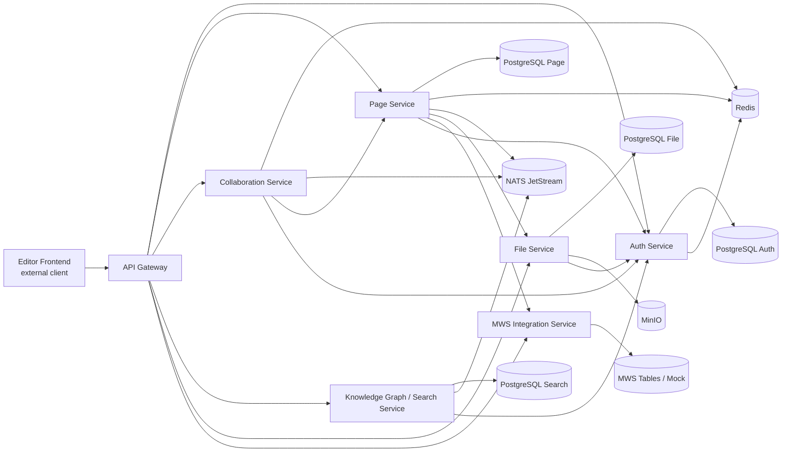

# MTC Wiki Editor Backend

Backend monorepo for the wiki editor platform described in `specs/001-wiki-editor-backend`.

Russian version: [README.ru.md](/C:/MTC/README.ru.md)

The repository contains a working demo stack with:

- API Gateway
- Auth Service
- Page Service
- Collaboration Service
- Knowledge Graph / Search Service
- MWS Integration Service
- File Service
- PostgreSQL databases per bounded context
- Redis
- NATS JetStream
- MinIO
- MWS mock

The default demo runtime is Docker Compose based and is the recommended way to start the system.

## What You Get

- page create, draft save, publish, restore, archive
- live MWS table embeds with degraded fallback behavior
- realtime collaboration over WebSocket with server-authoritative patch flow
- backlinks and PostgreSQL-backed search
- file upload, finalize, lookup, and soft delete
- RBAC through the Auth Service runtime path
- editor metadata, slash-menu catalog, hotkeys, and sync resume
- end-to-end Compose smoke validation

## Architecture Overview



### Service Responsibilities

- `API Gateway`: public entrypoint, JWT/auth middleware, OpenAPI, WebSocket upgrade proxy.
- `Auth Service`: login, refresh, JWKS, workspace/page grants, runtime authorization authority.
- `Page Service`: canonical document snapshot, draft/published heads, autosave, restore, archive, attachments, links, embed refs, outbox events.
- `Collaboration Service`: presence, live sessions, patch validation, session replay/reconnect, WebSocket protocol.
- `Knowledge Graph / Search Service`: backlink/read models, PostgreSQL full-text search, related pages, auth-aware filtering.
- `MWS Integration Service`: table access validation, schema/preview fetch, degraded embed descriptors.
- `File Service`: upload session, finalize, metadata persistence, MinIO object storage, soft delete.

## Editor Components And Integrations

This repository is backend-only, but it already defines the contracts expected by a block editor client.

```mermaid
flowchart TB
    UI[Editor UI]
    META[Metadata bootstrap\n/editor/metadata]
    DOC[Document state\ncanonical JSON snapshot]
    SYNC[Sync manager\n/pages/{id}/draft\n/editor/sync]
    WS[Realtime client\n/ws/collab]
    EMBED[Embed picker / resolver]
    FILEUP[File upload client]
    SEARCHBOX[Link/search picker]

    UI --> META
    UI --> DOC
    DOC --> SYNC
    DOC --> WS
    UI --> EMBED
    UI --> FILEUP
    UI --> SEARCHBOX

    META --> GW1[Gateway]
    SYNC --> GW1
    WS --> GW1
    EMBED --> GW1
    FILEUP --> GW1
    SEARCHBOX --> GW1

    GW1 --> PAGE2[Page Service]
    GW1 --> COLLAB2[Collaboration Service]
    GW1 --> MWS2[MWS Integration Service]
    GW1 --> FILES2[File Service]
    GW1 --> SEARCH2[Search Service]
```

### Editor-facing Backend Contracts

- `GET /api/v1/editor/metadata`: block catalog, slash-menu items, hotkeys, capability flags, embed catalog.
- `PATCH /api/v1/pages/{pageId}/draft`: revision-gated autosave of the full JSON snapshot.
- `GET /api/v1/pages/{pageId}`: draft/published page load with embed-aware hydration.
- `POST /api/v1/editor/sync`: sync resume and replay-window based reconciliation.
- `GET /ws/collab?page_id=...&workspace_id=...`: authenticated realtime collaboration session.
- `GET /api/v1/search?q=...&workspace_id=...`: search for references, links, and context recovery flows.
- `POST /api/v1/files/uploads` plus `POST /api/v1/files/uploads/{uploadId}/complete`: attachment upload flow.

### Current Editor Metadata Exposed By Backend

- supported block types:
  `paragraph`, `heading`, `checklist`, `quote`, `code`, `page_link`, `table_embed`, `image`, `file`
- slash-menu actions:
  paragraph, heading, checklist, quote, code, page link, MWS table, image, file
- hotkeys:
  `mod+/`, `mod+alt+1`, `mod+shift+7`, and `mod+shift+p` when publish is allowed
- capability flags:
  slash-menu, hotkeys, sync resume, replay window, realtime collaboration, files, embeds, MWS tables, publish, restore

## Feature Matrix From WikiLive Template

Source template: [WikiLive feature template](</C:/MTC/WikiLive шаблон фич (2).xlsx>)

| # | Feature | Type | Status in this repo | How it is implemented |
|---|---|---|---|---|
| 1.0 | Integration with MWS Tables via API | required | Implemented | `MWS Integration Service` validates access, fetches schema and preview, and returns degraded descriptors when MWS is unavailable. |
| 2.0 | Create and edit wiki page in MWS Tables scenario | required | Implemented | `Page Service` stores canonical JSON document snapshots and serves create/get/draft flows through Gateway. |
| 3.0 | Insert existing MWS table into page body | required | Implemented | Block type `table_embed` stores only embed metadata; live table data stays in MWS. |
| 4.0 | Autosave and restore after reload or return | required | Backend implemented | Revision-gated autosave, recovery, and sync resume are implemented; browser local cache itself belongs to frontend and is not part of this repo. |
| 5.0 | Slash-menu for fast block insertion | required | Implemented | Backend exposes slash-menu catalog via `/editor/metadata`; frontend can render from API instead of hardcoding. |
| 6.0 | Hotkeys for slash-menu and key editor commands | required | Implemented | Hotkey definitions are exposed via `/editor/metadata`; publish hotkey is capability-driven. |
| 7.0 | Links to other pages and backlinks | required | Implemented | Page links are extracted from canonical snapshots; Search Service builds backlink and related-page read models. |
| 8.0 | Collaborative document editing | required | Implemented | `Collaboration Service` provides authenticated WebSocket rooms, presence, patch validation, stale patch rejection, and reconnect handling. |
| 9.0 | Open-source editor with permissive license | required | Not implemented in this repo | This repository is backend-only. It exposes backend contracts for an editor but does not ship the frontend editor implementation itself. |
| 10.0 | Table on page as a live object | optional | Implemented | Embedded tables remain linked to MWS as source of truth, with schema/preview cache and degraded fallback. |
| 11.0 | Commenting | optional | Not implemented | Out of current MVP scope. |
| 12.0 | Versioning, edit history, separate drafts | optional | Implemented | Append-only revisions, version history, publish, restore, draft recovery, archived state. |
| 13.0 | AI suggestions or block generation | optional | Not implemented | Out of current MVP scope. |
| 14.0 | Graph of links between pages | optional | Partially implemented | The backend stores backlinks and related pages, but there is no dedicated graph visualization or graph traversal API. |
| 15.0 | Editor plugins or extensibility | optional | Partially implemented | Block model and metadata catalog are extensible, but a full plugin runtime or SDK is not implemented. |
| 16.0 | External embeds and widgets | optional | Partially implemented | MWS table embeds are implemented; generic widgets and arbitrary external embeds are not. |
| 17.0 | Design Kit compliance | optional | Not implemented in this repo | Backend repository; design system and frontend visual compliance are outside backend scope. |
| 18.0 | Other functionality | optional | Implemented as repo extras | Search, file uploads, RBAC, archive, Compose smoke validation, OpenAPI contract, and demo runtime automation. |

## Mandatory And Additional Features

### Mandatory Features In Current MVP

- Live MWS table embeds:
  `Page Service` stores only embed reference metadata, while `MWS Integration Service` fetches schema/preview and validates table access.
- Create, edit, publish, restore, archive:
  `Page Service` owns canonical draft and published heads, append-only revisions, and lifecycle transitions.
- Autosave and draft recovery:
  every autosave includes `base_revision_no`; stale writes are rejected explicitly; recovery returns the latest accepted draft state.
- Slash-menu, hotkeys, editor metadata:
  `Page Service` exposes editor catalog and capabilities through `/editor/metadata`.
- Realtime collaboration:
  `Collaboration Service` accepts validated patches against a base revision and broadcasts only server-accepted updates.
- Links, backlinks, search:
  `Page Service` extracts links; `Knowledge Graph / Search Service` projects them into backlink and search read models and PostgreSQL FTS indexes.
- File uploads:
  `File Service` manages upload sessions, metadata persistence, MinIO object storage, download URLs, and soft delete.
- RBAC:
  `Auth Service` is the runtime authority for workspace and page grants; other services call it via gRPC for authorization decisions.

### Additional Or Optional Features Already Available

- Version history and restore:
  publish does not destroy draft history; restore creates a new draft head from a previous revision.
- Sync resume and replay window:
  `/editor/sync` can resume from meaningful server-side resumable state instead of forcing a full reload every time.
- Related pages:
  `Knowledge Graph / Search Service` returns not only backlinks but also meaningful related pages.
- Attachment-aware pages:
  `Page Service` can link file references into canonical document blocks without owning binary storage.

### Additional Features Not Implemented Yet

- commenting
- AI assistance or generation
- generic external widgets beyond MWS embeds
- standalone graph view of page relationships
- frontend editor package inside this repository

## Repository Layout

```text
deploy/      Docker Compose and infra config
pkg/         Shared Go packages and contracts
scripts/     Bootstrap and migration helpers
services/    All backend services
specs/       Feature specs and OpenAPI contract
tests/       Contract, integration, realtime, and compose smoke tests
```

## Prerequisites

- Docker Desktop with Compose support
- Go 1.23+ if you want to run services or tools outside Docker
- PowerShell or a POSIX shell for helper scripts

## Quick Start

### 1. Prepare environment

```bash
cp .env.example .env
```

On Windows PowerShell:

```powershell
Copy-Item .env.example .env
```

### 2. Start the full demo stack

```bash
docker compose --env-file .env -f deploy/docker-compose.yml up -d --build
```

### 3. Run migrations

```bash
bash scripts/migrate.sh up
```

On Windows PowerShell:

```powershell
powershell -ExecutionPolicy Bypass -File .\scripts\migrate.ps1 up
```

### 4. Seed demo auth data

```bash
docker compose --env-file .env -f deploy/docker-compose.yml exec -T auth-service /app/seed-demo
```

### 5. Verify the demo runtime

```bash
bash tests/compose/demo_smoke_test.sh
```

On Windows PowerShell:

```powershell
powershell -ExecutionPolicy Bypass -File .\tests\compose\demo_smoke_test.ps1
```

If the smoke test passes, the stack is in the expected demo-ready state.

## One-Command Bootstrap

If you want the repo to do the common setup for you:

```bash
bash scripts/bootstrap-demo.sh
```

This script will:

1. create `.env` from `.env.example` if needed
2. run `go work sync`
3. build and start Compose
4. apply migrations
5. seed demo auth data

## Useful Make Targets

```bash
make help
make env
make compose-build
make compose-up
make compose-down
make compose-logs
make compose-smoke
make migrate
make migrate-down
make seed-auth-demo
make test
```

## Demo Walkthrough

This is a practical sequence for a live backend demo using the default Docker Compose runtime.

### 1. Start the stack

```bash
docker compose --env-file .env -f deploy/docker-compose.yml up -d --build
bash scripts/migrate.sh up
docker compose --env-file .env -f deploy/docker-compose.yml exec -T auth-service /app/seed-demo
```

### 2. Authenticate and get a token

Example request:

```bash
curl -s http://localhost:8080/api/v1/auth/login \
  -H "Content-Type: application/json" \
  -d '{"email":"editor@example.com","password":"password123"}'
```

Use the returned `access_token` as:

```text
Authorization: Bearer <access_token>
```

### 3. Create a page

```bash
curl -s http://localhost:8080/api/v1/pages \
  -H "Authorization: Bearer <access_token>" \
  -H "Content-Type: application/json" \
  -d '{
    "workspace_id":"11111111-1111-1111-1111-111111111111",
    "title":"Demo page",
    "initial_document":{
      "blocks":[
        {"id":"blk-1","type":"heading","text":"Demo page"},
        {"id":"blk-2","type":"paragraph","text":"Initial content"}
      ]
    }
  }'
```

### 4. Autosave a new draft revision

```bash
curl -s -X PATCH http://localhost:8080/api/v1/pages/<page_id>/draft \
  -H "Authorization: Bearer <access_token>" \
  -H "Content-Type: application/json" \
  -H "Idempotency-Key: demo-draft-1" \
  -d '{
    "base_revision_no":1,
    "document":{
      "blocks":[
        {"id":"blk-1","type":"heading","text":"Demo page"},
        {"id":"blk-2","type":"paragraph","text":"Updated draft text"},
        {"id":"blk-3","type":"quote","text":"Quote block"}
      ]
    }
  }'
```

### 5. Show editor metadata

```bash
curl -s "http://localhost:8080/api/v1/editor/metadata?workspace_id=11111111-1111-1111-1111-111111111111&page_id=<page_id>" \
  -H "Authorization: Bearer <access_token>"
```

Use this step to show:

- block catalog
- slash-menu commands
- hotkeys
- capability flags
- MWS embed availability

### 6. Publish and inspect history

```bash
curl -s -X POST http://localhost:8080/api/v1/pages/<page_id>/publish \
  -H "Authorization: Bearer <access_token>" \
  -H "Content-Type: application/json" \
  -d '{"base_revision_no":2}'
```

Then:

```bash
curl -s http://localhost:8080/api/v1/pages/<page_id>/versions \
  -H "Authorization: Bearer <access_token>"
```

### 7. Search and backlinks

```bash
curl -s "http://localhost:8080/api/v1/search?workspace_id=11111111-1111-1111-1111-111111111111&q=Demo" \
  -H "Authorization: Bearer <access_token>"
```

```bash
curl -s http://localhost:8080/api/v1/pages/<page_id>/backlinks \
  -H "Authorization: Bearer <access_token>"
```

### 8. File upload flow

Start upload:

```bash
curl -s -X POST http://localhost:8080/api/v1/files/uploads \
  -H "Authorization: Bearer <access_token>" \
  -H "Content-Type: application/json" \
  -d '{
    "workspace_id":"11111111-1111-1111-1111-111111111111",
    "page_id":"<page_id>",
    "filename":"demo.txt",
    "content_type":"text/plain",
    "size_bytes":12,
    "checksum":"demo-checksum"
  }'
```

Complete upload after object PUT:

```bash
curl -s -X POST http://localhost:8080/api/v1/files/uploads/<upload_id>/complete \
  -H "Authorization: Bearer <access_token>" \
  -H "Content-Type: application/json" \
  -d '{"page_id":"<page_id>","checksum":"demo-checksum"}'
```

### 9. Realtime collaboration

Open a WebSocket to:

```text
ws://localhost:8080/ws/collab?page_id=<page_id>&workspace_id=11111111-1111-1111-1111-111111111111
```

Headers:

```text
Authorization: Bearer <access_token>
X-Request-Id: demo-ws-1
```

Then send `join_session`, presence updates, and `submit_patch` messages according to:

- [websocket-protocol.md](/C:/MTC/specs/001-wiki-editor-backend/contracts/websocket-protocol.md)

### 10. Prove the whole stack is healthy

```bash
bash tests/compose/demo_smoke_test.sh
```

## Default Runtime Endpoints

Host-exposed endpoints for the demo:

- Gateway: `http://localhost:8080`
- Auth Service: `http://localhost:8081`
- Page Service: `http://localhost:8082`
- Collaboration Service: `http://localhost:8083`
- Search Service: `http://localhost:8084`
- MWS Integration Service: `http://localhost:8085`
- File Service: `http://localhost:8086`
- MWS Mock: `http://localhost:8090`

Health endpoints:

- `http://localhost:8080/health/ready`
- `http://localhost:8081/health/ready`
- `http://localhost:8082/health/ready`
- `http://localhost:8083/health/ready`
- `http://localhost:8084/health/ready`
- `http://localhost:8085/health/ready`
- `http://localhost:8086/health/ready`

Notes:

- MinIO is intentionally internal to the Compose network in the default demo path.
- Prometheus is also not exposed on the host by default.
- Internal service-to-service gRPC, Redis, NATS, and MinIO wiring is configured through `.env`.

## Local Development Notes

### Run Go tests

From the repository root:

```bash
go test ./...
```

Or use:

```bash
make test
```

### Tail logs

```bash
docker compose --env-file .env -f deploy/docker-compose.yml logs -f
```

### Stop and remove the stack

```bash
docker compose --env-file .env -f deploy/docker-compose.yml down --remove-orphans
```

To remove named volumes too:

```bash
docker compose --env-file .env -f deploy/docker-compose.yml down -v --remove-orphans
```

## API Contract

The public API contract used by the gateway lives here:

```text
specs/001-wiki-editor-backend/contracts/public-api.openapi.yaml
```

This file is also copied into the gateway image during Docker build.

## Troubleshooting

### Compose starts but a service is unhealthy

Check service logs:

```bash
docker compose --env-file .env -f deploy/docker-compose.yml logs <service-name>
```

Typical service names:

- `gateway`
- `auth-service`
- `page-service`
- `collaboration-service`
- `knowledge-graph-search-service`
- `mws-integration-service`
- `file-service`

### Migrations fail

Re-run migrations after the databases are healthy:

```bash
bash scripts/migrate.sh up
```

### You want a high-confidence end-to-end check

Run the Compose smoke test:

```bash
bash tests/compose/demo_smoke_test.sh
```

It validates the real `cmd/server` boot path, env wiring, health endpoints, auth seeding, and an end-to-end workflow through the gateway.
